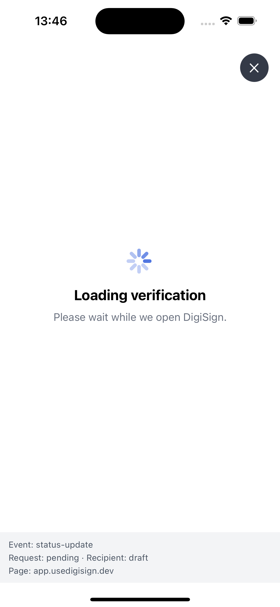
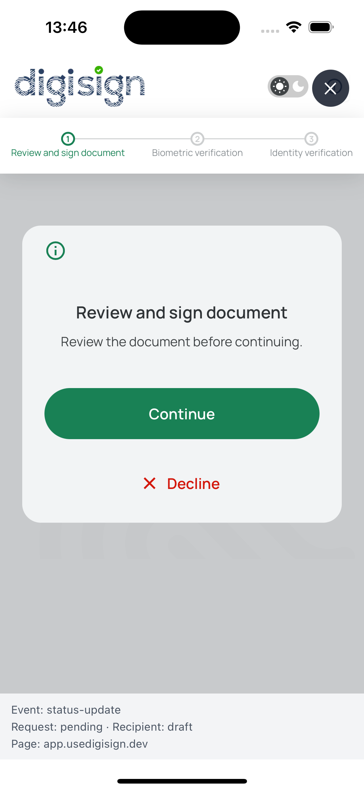
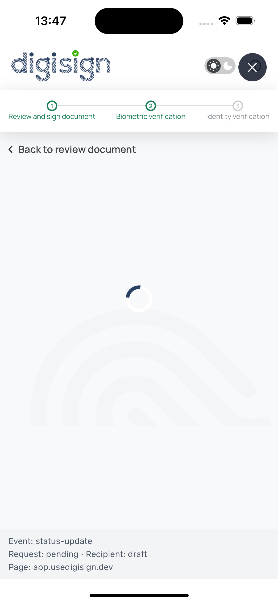
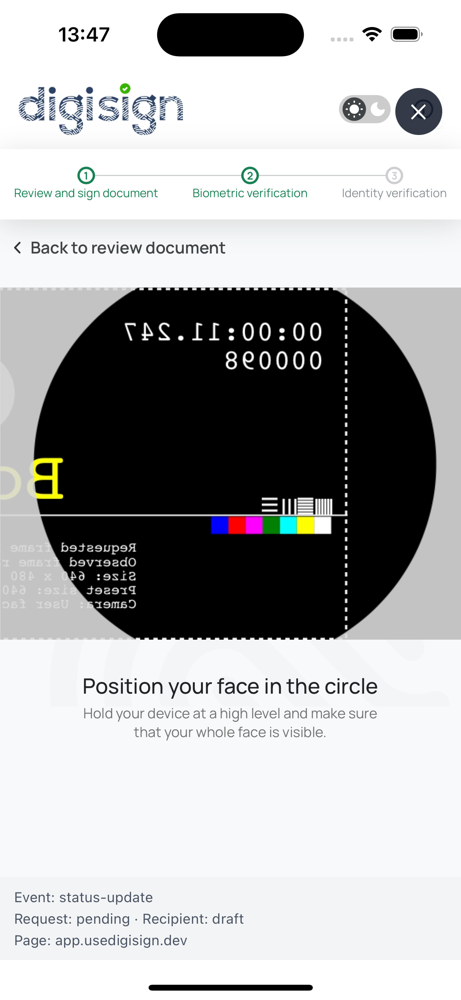

# DigiSign Verification SDK

React Native and Expo integration for DigiSign identity verification flows.

## Workspace

- `packages/react-native` — reusable `@usedigisign/react-native-verification-sdk` package.
- `examples/expo-example` — Expo SDK 57 development-build example app.
- `docs/` — integration notes and platform requirements.

## Flow preview

The Expo example demonstrates the SDK loading state and the DigiSign Web
verification flow:

| Loading verification                                                                          | Review and sign                                                                     |
| --------------------------------------------------------------------------------------------- | ----------------------------------------------------------------------------------- |
|  |  |

| Biometric verification loading                                                                       | Face positioning                                                                      |
| ---------------------------------------------------------------------------------------------------- | ------------------------------------------------------------------------------------- |
|  |  |

## Requirements

- Node.js `>=22.13.0`
- pnpm `9.4.0`
- Expo SDK `57`
- Android 7+ / API 24+
- iOS 16.4+
- Android SDK 36 and Xcode 26.4+

## Install and run

```sh
pnpm install
pnpm example:start
```

The SDK proactively requests camera and microphone permissions before mounting
the WebView. It does not require `expo-camera`; it uses
`react-native-permissions`, while the DigiSign page still calls `getUserMedia()`
inside the WebView. The host app must declare the native permissions in its
Expo config:

```json
{
  "expo": {
    "ios": {
      "infoPlist": {
        "NSCameraUsageDescription": "Camera access is required for verification.",
        "NSMicrophoneUsageDescription": "Microphone access is required for video verification."
      }
    },
    "android": {
      "permissions": ["CAMERA", "RECORD_AUDIO"]
    },
    "plugins": [["react-native-permissions", { "iosPermissions": ["Camera", "Microphone"] }]]
  }
}
```

Use a development build for native WebView permission behavior:

```sh
pnpm example:ios
pnpm example:android
```

Expo Go is not sufficient for this integration because the verification flow
depends on native WebView permission callbacks.

## Automated Expo demo

The example includes a local bootstrap server that automates the complete demo
setup: it exchanges the server-side API key for a short-lived session, selects
the workspace, generates a PDF, uploads it through DigiSign's upload-session
and presigned-upload flow, creates a single-use signing request, and returns
the request and recipient IDs to Expo.

Never put `DIGISIGN_API_KEY` in the Expo app. Configure it only for the local
Node server:

```sh
cp examples/demo-server/.env.example examples/demo-server/.env
# Edit examples/demo-server/.env and set DIGISIGN_API_KEY
pnpm demo:server
```

The Android emulator reaches the host server at `http://10.0.2.2:8787` by
default. For a physical device, set the LAN address before starting Expo:

```sh
EXPO_PUBLIC_DEMO_SERVER_URL=http://192.168.1.10:8787 pnpm example:start
```

Tap **Create demo verification** in the example. The server-side flow uses
`POST /v1/keys/session`, `GET /v1/workspaces`,
`POST /v1/media/single-use/upload-session`, a `PUT` to the returned upload URL,
and `POST /v1/requests/single-use` before the SDK opens the verification link.

## Usage

```tsx
import { VerificationWebView } from "@usedigisign/react-native-verification-sdk";

<VerificationWebView
  requestPublicId={requestPublicId}
  recipientPublicId={recipientPublicId}
  accessToken={shortLivedSessionToken}
  workspaceId={workspacePublicId}
  organisationId={organisationPublicId}
  apiBaseUrl="https://sandbox.usedigisign.dev"
  onCancel={() => navigation.goBack()}
  onSigningStatus={(status) => console.log(status.request_status, status.recipient_status)}
/>;
```

The SDK calls `POST /v1/requests/{requestPublicId}/recipients/{recipientPublicId}/signing-access`
internally, reads the returned verification `link`, and polls
`GET .../signing-status` every four seconds. The access token must be a
short-lived DigiSign session JWT and `workspaceId` is sent as
`x-ws-identifier`; `organisationId` is sent as `x-o10n-identifier`. Do not ship a permanent API key in the mobile app; obtain
the session token through your backend or another protected session flow.

`apiBaseUrl` defaults to `https://sandbox.usedigisign.dev`. Configure the
production API base URL for production deployments. The direct `url` prop is
also supported for integrations that already fetch the signing link.

## Public API

The package exports `VerificationWebView`, `DigiSignApiError`,
`DIGISIGN_ALLOWED_ORIGINS`, and `DEFAULT_DIGISIGN_API_BASE_URL`, together with
the TypeScript types listed below.

### Constants

| Constant                        | Description                                                     |
| ------------------------------- | --------------------------------------------------------------- |
| `DEFAULT_DIGISIGN_API_BASE_URL` | Sandbox API origin used when `apiBaseUrl` is not provided.      |
| `DIGISIGN_ALLOWED_ORIGINS`      | Production and sandbox DigiSign Web origins allowed by default. |

### `VerificationWebView` props

Use exactly one flow:

- Direct URL flow: provide `url`.
- Internal access flow: provide `requestPublicId`, `recipientPublicId`,
  `accessToken`, `workspaceId`, and `organisationId`.

| Prop                      | Type                   | Description                                                      |
| ------------------------- | ---------------------- | ---------------------------------------------------------------- |
| `url`                     | `string`               | Existing DigiSign verification URL.                              |
| `requestPublicId`         | `string`               | Request ID for SDK-managed link retrieval and status polling.    |
| `recipientPublicId`       | `string`               | Recipient ID for SDK-managed link retrieval and status polling.  |
| `accessToken`             | `string`               | Short-lived DigiSign session JWT. Never use a permanent API key. |
| `workspaceId`             | `string`               | Workspace public ID sent as `x-ws-identifier`.                   |
| `organisationId`          | `string`               | Organisation public ID sent as `x-o10n-identifier`.              |
| `apiBaseUrl`              | `string`               | DigiSign API origin. Defaults to the sandbox.                    |
| `pollIntervalMs`          | `number`               | Status polling interval. Defaults to 4000 ms.                    |
| `allowedOrigins`          | `readonly string[]`    | HTTPS origins allowed for the verification page.                 |
| `onCancel`                | `() => void`           | Called by the default or custom cancel control.                  |
| `onEvent`                 | `(event) => void`      | Receives SDK lifecycle and error events.                         |
| `onSigningStatus`         | `(status) => void`     | Receives each successful status poll.                            |
| `onTerminal`              | `(status) => void`     | Receives a terminal request status.                              |
| `onNavigationStateChange` | `(url) => void`        | Receives WebView navigation URLs.                                |
| `renderCancel`            | `(props) => ReactNode` | Replaces the default cancel button.                              |
| `renderError`             | `(props) => ReactNode` | Replaces the default error surface.                              |
| `renderLoading`           | `() => ReactNode`      | Replaces the default loading surface.                            |
| `renderPermissionDenied`  | `(props) => ReactNode` | Replaces the permission surface.                                 |

### Events

`onEvent` receives a `VerificationEvent` with a `type` and optional `error`,
`code`, `statusCode`, and `status` fields.

| Event                                                        | Meaning                                                         |
| ------------------------------------------------------------ | --------------------------------------------------------------- |
| `access-loading` / `access-loaded`                           | Internal flow is fetching or has resolved the verification URL. |
| `access-error`                                               | The internal access request failed.                             |
| `credit-error`                                               | DigiSign returned an exhausted-credit error; retry is disabled. |
| `loading` / `loaded`                                         | The WebView started or finished loading.                        |
| `webview-error`                                              | The WebView failed to load or its process terminated.           |
| `invalid-origin`                                             | The URL is outside `allowedOrigins`.                            |
| `permission-denied`                                          | Camera or microphone permission is unavailable.                 |
| `status-update`                                              | A status poll completed successfully.                           |
| `status-error`                                               | A status poll failed and may be retried with backoff.           |
| `signed`                                                     | The recipient submitted their signature.                        |
| `completed`, `rejected`, `expired`, `voided`, `do-not-trust` | The request reached a terminal state.                           |

`DigiSignApiError` exposes `status`, `code`, and `isInsufficientCredits` for
consumers that need to classify DigiSign API failures.

The component includes loading, error, retry, and cancel UI when `onCancel` is
provided. Consumers can replace these surfaces with render props:

```tsx
<VerificationWebView
  requestPublicId={requestPublicId}
  recipientPublicId={recipientPublicId}
  accessToken={shortLivedSessionToken}
  workspaceId={workspacePublicId}
  organisationId={organisationPublicId}
  onCancel={closeVerification}
  renderLoading={() => <YourLoadingView />}
  renderError={({ error, onRetry }) => <YourErrorView message={error.error} onRetry={onRetry} />}
  renderPermissionDenied={({ onRetry, onOpenSettings, canOpenSettings }) => (
    <YourPermissionView
      onRetry={onRetry}
      onOpenSettings={onOpenSettings}
      canOpenSettings={canOpenSettings}
    />
  )}
  renderCancel={({ onCancel }) => <YourCancelButton onPress={onCancel} />}
/>
```

When the DigiSign API reports an exhausted organization wallet, the SDK emits
`{ type: "credit-error", statusCode: 402, code: "INSUFFICIENT_CREDITS" }` and
does not retry the request or status poll. The default error surface asks the
consumer to recharge rather than offering a retry that cannot succeed. Custom
error renderers should branch on `error.type` or `error.code`, not on the
message text:

```tsx
renderError={({ error }) =>
  error.type === "credit-error" ? (
    <YourRechargeRequiredView />
  ) : (
    <YourErrorView message={error.error} />
  )}
```

When a user has permanently blocked a permission, the default permission view
offers an **Open Settings** action. Custom permission views receive
`canOpenSettings` and `onOpenSettings`; the SDK re-checks permissions when the
app returns from Settings.

In direct URL mode, the host app is responsible for obtaining the DigiSign
verification URL. In internal access mode, the SDK obtains that URL from the
DigiSign service using the supplied request, recipient, workspace, organisation,
and short-lived session credentials. The host app remains responsible for
deciding what to do after the verification flow completes. By default, the SDK
allows `usedigisign.com`, `usedigisign.dev`, and their HTTPS subdomains.
Consumers can override this with `allowedOrigins` when using a controlled
DigiSign environment.
